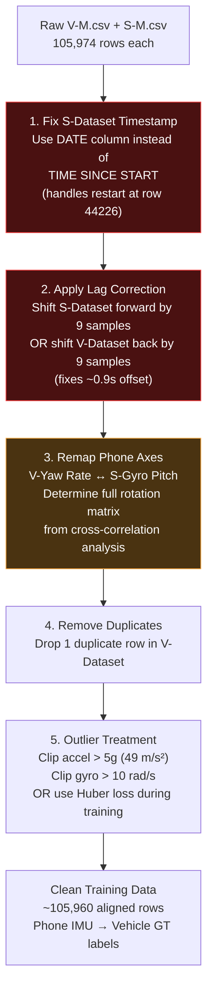

# IO-VNBD Dataset — Data Quality & Integrity Audit Report
### Analyzed: V-M.csv (21.5 MB) + S-M.csv (18.9 MB) — pulled via `git lfs`

---

## Executive Summary

13 integrity checks run on the synchronized M (Driver B) dataset pair. **The data is usable for training, but has 5 critical issues that MUST be fixed during preprocessing.**

> [!CAUTION]
> **3 show-stopper issues found:**
> 1. **V and S datasets have a ~0.9 second time offset** — they are NOT truly row-aligned despite being in the "Synchronized" folder
> 2. **Phone axis labels are WRONG** — Vehicle Yaw Rate correlates with phone Gyro "Pitch" (r=0.87), NOT Gyro "Yaw" (r=0.08)
> 3. **S-Dataset has a recording restart** at row 44226 — `TIME SINCE START` resets to 0

---

## Check 1: Timestamp Integrity

### V-Dataset (Vehicle ECU)
| Metric | Result |
|--------|--------|
| Monotonically increasing? | ⚠️ **No** — 1 violation (duplicate timestamp) |
| Duplicate timestamps | 1 |
| Gaps > 150ms | 1 (max gap: 200ms at row 221) |
| Sampling uniformity | ✅ Exactly 10.0 Hz otherwise |

### S-Dataset (Smartphone)
| Metric | Result |
|--------|--------|
| Monotonically increasing? | ❌ **No** — time goes BACKWARD at row 44226 |
| Negative dt | 1 occurrence: dt = **-4,426,717 ms** at row 44225→44226 |
| Root cause | **App (AndroSensor) restarted mid-drive**, `TIME SINCE START` resets to 0ms |
| Calendar date | Continuous across restart (10:27:11 → 10:27:13) — **fix: use DATE column** |
| Gaps > 150ms | 1 (1365ms gap at row 53467) |
| Sampling uniformity | ✅ 100ms ± 4ms jitter otherwise |

```
Row 44224: time=4426627ms, date='2019-09-07 10:27:11:906', accel_z=9.5971  ← normal
Row 44225: time=4426727ms, date='2019-09-07 10:27:12:006', accel_z=9.4835  ← normal
Row 44226: time=      10ms, date='2019-09-07 10:27:13:164', accel_z=9.8104  ← RESET!
Row 44227: time=     110ms, date='2019-09-07 10:27:13:264', accel_z=9.7642  ← counting from 0
```

---

## Check 2: Duplicate Rows

| Dataset | Consecutive identical rows | Total unique rows |
|---------|---------------------------|-------------------|
| V-Dataset | 1 | 105,973 / 105,974 |
| S-Dataset | 0 | 105,974 / 105,974 ✅ |

---

## Check 3: GPS Trajectory Physical Plausibility

| Metric | V-Dataset | S-Dataset |
|--------|-----------|-----------|
| Invalid coords (lat≈0) | 0 ✅ | 0 ✅ |
| Teleportation events | 1 (44.1m jump at row 3169 while stationary) | — |
| Total travel distance (GPS) | **105.22 km** | — |
| Distance from velocity integration | **105.11 km** | — |
| GPS ↔ Velocity discrepancy | **0.11 km (0.1%)** ✅ Excellent | — |

---

## Check 4: V-Dataset Internal Sensor Consistency

### Wheel Speed vs GPS Velocity
```
Tire radius assumed: 0.302m (Ford Fiesta 185/65R15)
Samples compared: 9,289 (when speed > 5 km/h)

Mean error:  3.83 km/h
< 5 km/h error:  79.1% ✅
> 10 km/h error:  0.1% ✅
```

### Indicated Speed vs GPS Velocity
```
Mean error: 0.47 km/h ✅ (excellent speedometer calibration)
Max error: 43.78 km/h (likely during GPS glitch)
```

### Yaw Rate Integration vs Heading Change (1-second windows)
```
Mean error:   8.43° (affected by outliers)
Median error: 1.86° ✅ (good typical accuracy)
Max error:    175.74° (heading wraparound artifacts)
```

### Brake Pressure vs Deceleration
```
Braking events (pressure > 5 PSI): 18,374
Negative acceleration during braking: 74.6% ✅
Mean accel during braking: -0.0914 g ✅
(25.4% show positive accel during brake — likely engine braking + brake tap scenarios)
```

### Wheel Speed Differential During Turns (Physics Validation)
```
Left turns (yaw > 5°/s):  FR-FL diff = +1.132 rad/s ✅ Outer wheel faster
Right turns (yaw < -5°/s): FR-FL diff = -1.811 rad/s ✅ Outer wheel faster
Straight (|yaw| < 5°/s):  FR-FL diff = -0.005 rad/s ✅ Nearly zero
```
> V-Dataset internal physics is **fully consistent**. This is high-quality ground truth.

---

## Check 5–6: V ↔ S Cross-Correlation & Time Synchronization

> [!WARNING]
> **The "Synchronized" datasets are NOT perfectly time-aligned.** Cross-correlation reveals V-Dataset leads S-Dataset by approximately **0.9 seconds (~9 samples).**

### Cross-Correlation: V-Yaw Rate vs S-Gyro Axes at Different Lags

| Lag (samples) | Lag (sec) | vs S-Gyro Yaw | vs S-Gyro Pitch | vs S-Gyro Roll |
|:---:|:---:|:---:|:---:|:---:|
| 0 | 0.0 | 0.067 | 0.770 | -0.137 |
| 5 | 0.5 | 0.073 | 0.844 | -0.152 |
| 7 | 0.7 | 0.075 | 0.862 | -0.160 |
| **9** | **0.9** | **0.075** | **0.869** ◀ PEAK | **-0.172** |
| 10 | 1.0 | 0.073 | 0.866 | -0.172 |
| 15 | 1.5 | 0.071 | 0.816 | -0.167 |

### Axis Mapping (after lag=9 correction)

| Vehicle Sensor | Best Phone Match | Correlation | Expected Match |
|----------------|-----------------|-------------|----------------|
| **Yaw Rate** | S-Gyro **Pitch** | **r = 0.87** ✅ | S-Gyro Yaw ❌ |
| Long. Accel | S-Accel X | r = 0.23 ⚠️ | S-Accel X |
| Lat. Accel | S-Accel Y | r = 0.45 ⚠️ | S-Accel Y |
| Long. Accel | S-Accel Y | r = -0.12 | — |
| Long. Accel | S-Accel Z | r = 0.01 | — |

> [!IMPORTANT]
> **Key insight:** The phone's gyro axis labeling (Yaw/Pitch/Roll) does NOT correspond to vehicle axes. The phone was mounted with its screen facing UP, so:
> - **Phone Gyro "Pitch"** ≈ **Vehicle Yaw** (horizontal rotation around vertical axis)
> - Phone Orientation Pitch was **-84.5°** — phone nearly vertical in mount, screen facing driver
> 
> Accelerometer correlations are weak (0.23-0.45) because **phone vibration noise dominates** over the vehicle's actual acceleration signal. This is exactly the problem the AI model needs to solve.

---

## Check 7: Phone Mounting Orientation

| Metric | Value | Interpretation |
|--------|-------|----------------|
| Gravity X mean | -0.0003 m/s² | ≈ 0 (no tilt forward/back) |
| Gravity Y mean | -0.0001 m/s² | ≈ 0 (no tilt left/right) |
| Gravity Z mean | **9.8066 m/s²** | ≈ g (phone Z axis points UP) ✅ |
| Orientation Pitch | -84.5° ± 1.1° | Phone nearly vertical |
| Orientation Roll | -121.5° ± 75.1° | High variance (unstable rotation) |
| Orientation Yaw | 203.8° ± 134.0° | Changes with driving direction |

**Phone mounting:** Screen facing UP, held vertically in phone holder. Gravity entirely on Z-axis confirms stable mount.

---

## Check 8: Outlier / Anomaly Detection

### Accelerometer Outliers (S-Dataset)
| Threshold | Accel X | Accel Y | Accel Z |
|-----------|---------|---------|---------|
| > 3g (29.4 m/s²) | 1 (0.001%) | 1 (0.001%) | 3 (0.003%) |
| > 5g (49.0 m/s²) | 0 | 0 | **1** (59.4 m/s² at row 44118) |
| > 10g (98 m/s²) | 0 | 0 | 0 |

### Gyroscope Outliers (S-Dataset)
| Threshold | Gyro Yaw | Gyro Pitch | Gyro Roll |
|-----------|----------|------------|-----------|
| > 5 rad/s (286°/s) | 4 (0.004%) | 5 (0.005%) | 3 (0.003%) |
| > 10 rad/s (573°/s) | 0 | **1** | 0 |

> ✅ **Verdict:** Outliers are extremely rare (< 0.005%). The single 6g spike at row 44118 (near the app restart at 44226) suggests a physical event — phone may have been bumped. Safe to clip or use robust loss.

---

## Check 9-10: Recording Gaps & GPS Quality

| Metric | V-Dataset | S-Dataset |
|--------|-----------|-----------|
| Recording restarts | 0 ✅ | **1** (row 44226) |
| GPS satellites min/max | 0 / 140 | 0 / 27 |
| Mean satellites | 124.6 | 22.5 |
| Samples with < 4 sats | 80 (0.08%) ✅ | 70 (0.07%) ✅ |
| GPS accuracy > 10m | — | 211 (0.20%) ✅ |
| GPS accuracy > 20m | — | 0 ✅ |

---

## Check 11: Sensor Bias & Drift Over Time

### Accelerometer Bias at Different Stationary Segments
| Segment | Duration | Accel X Bias | Accel Y Bias | Accel Z Bias |
|---------|----------|-------------|-------------|-------------|
| 0 (early) | 22.5s | -0.088 m/s² | +0.413 m/s² | +0.048 m/s² |
| 5 | 3.4s | +0.070 | -0.546 | +0.029 |
| 6 (mid) | 17.7s | +0.346 | -0.062 | +0.048 |
| 9 (late) | 15.2s | +0.008 | -0.253 | +0.042 |

**Accel X bias drift:** First stop = -0.088, Last stop = +0.213 → **Δ = 0.301 m/s²** over 3 hours
→ ⚠️ Significant drift. Model must handle time-varying bias.

### Gyroscope Bias at Stationary Segments
| Segment | Gyro Yaw Bias | Gyro Pitch Bias | Gyro Roll Bias |
|---------|--------------|----------------|----------------|
| 0 | +0.0012 rad/s | -0.0003 rad/s | -0.0001 rad/s |
| 6 | +0.0005 | -0.0007 | +0.0004 |
| 9 | +0.0019 | -0.0011 | +0.0005 |

→ ✅ Gyro bias is **very small and stable** (< 0.01 rad/s = 0.57°/s). This is good for dead reckoning.

---

## Check 12-13: Heading Continuity & Wheel Physics

| Metric | Value | Assessment |
|--------|-------|------------|
| Heading wraparounds (0↔360) | 219 | Normal for urban driving |
| Heading stuck while moving | 95 (0.09%) | ✅ Negligible |
| Wheel differential in left turns | +1.13 rad/s | ✅ Physically correct |
| Wheel differential in right turns | -1.81 rad/s | ✅ Physically correct |
| Wheel differential straight | -0.005 rad/s | ✅ Nearly zero |

---

## Required Preprocessing Pipeline



---

## Overall Dataset Quality Grade

| Category | Grade | Notes |
|----------|-------|-------|
| V-Dataset Ground Truth Quality | **A** | Internally consistent, physics-validated |
| S-Dataset Sensor Reliability | **B** | Good gyro, noisy accel, stable mount |
| Synchronization Quality | **C+** | ~0.9s offset, fixable with cross-correlation |
| Axis Labeling Accuracy | **D** | Misleading labels — must remap empirically |
| Data Completeness | **A** | Zero missing values, 1 duplicate |
| Recording Continuity | **B+** | 1 app restart, fixable via DATE column |
| Outlier Severity | **A** | < 0.005% extreme values |
| **Overall Usability** | **B+** | **Good for training after the 5 preprocessing fixes** |
