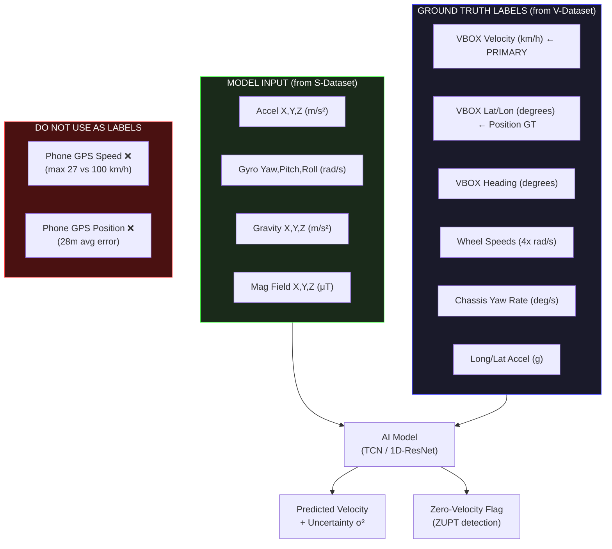
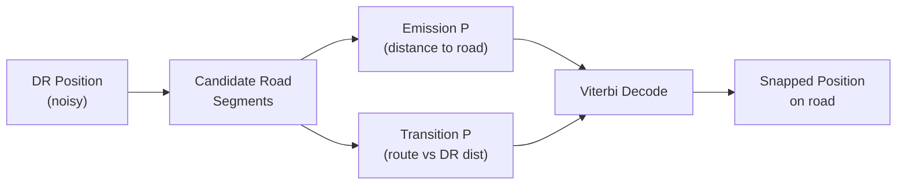
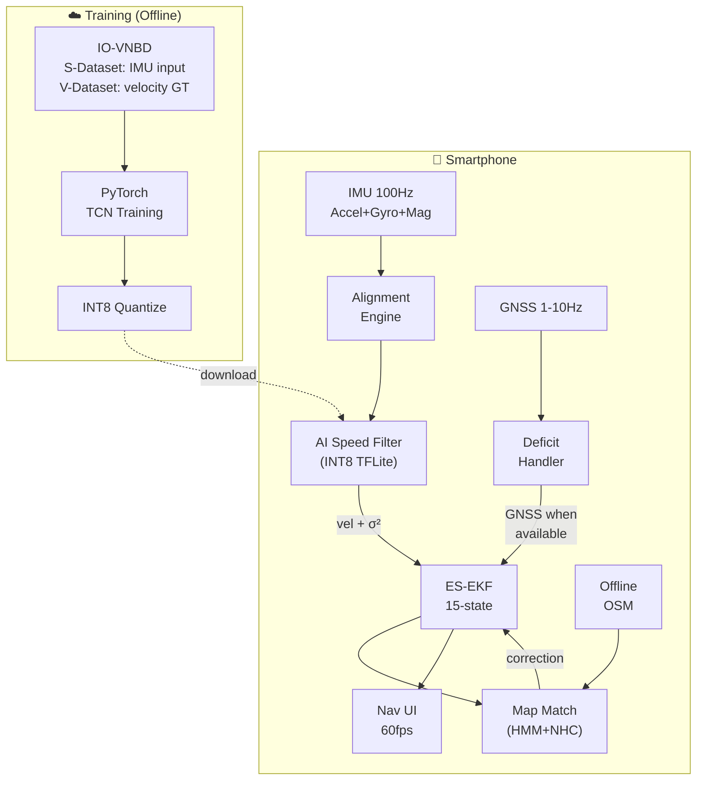

# SIH 2026 — AI-ML Based Intelligent Dead Reckoning System
## Problem Statement 26168 | Organization: ISRO

---

## 1. Problem Understanding

### What They Want
ISRO wants a **lightweight, edge-deployable software engine + mobile app** that turns a standalone smartphone into an **Intelligent Dead Reckoning (IDR)** system with GNSS fusion. The core challenge:

> When GNSS signals drop (tunnels, underpasses, urban canyons, dense forests), continue providing **lane-level accurate navigation** using only the smartphone's internal MEMS IMU sensors — **without any physical connection** to the vehicle's OBD-II / CAN bus.

> [!IMPORTANT]
> This is a **dual-deliverable** problem:
> 1. **Mobile Application** — Real-time navigation on smartphone using phone's built-in IMU + GNSS
> 2. **Edge Deployable Software Engine** — Works with external FOG-based IMU sensors at higher update rates (~200Hz)

### The Core Technical Challenge

```
                  GNSS Available                    GNSS Blackout (Tunnel/Underpass)
                  ┌───────────┐                     ┌─────────────────────────────┐
                  │  GPS Fix   │ ─── Signal Lost ──→ │  Dead Reckoning Mode        │
                  │  ± 3-5m    │                     │  IMU Only (Accel + Gyro)    │
                  │  accuracy  │                     │  DRIFT ACCUMULATES          │
                  └───────────┘                     │  EXPONENTIALLY!             │
                       ↑                            └─────────────────────────────┘
                       │                                         │
                       └──── Signal Restored ────────────────────┘
                             Seamless Handoff
```

**Why it's hard on smartphones:**
- Consumer MEMS IMU has bias drift: accelerometer bias of just 0.05 m/s² → **250m position error** in 100 seconds
- Gyro bias of 0.5°/s → **512m drift** in 60 seconds (cubic growth!)
- Phone is subjected to engine vibrations, potholes, braking jolts, mount misalignment
- No external speedometer / odometer feed available

---

## 2. IO-VNBD Dataset — Deep Analysis

> [!CAUTION]
> All 727 CSV/JPG/ZIP files are **Git LFS pointers** (~130 bytes each). Total dataset is **2.14 GB**. Must run `git lfs pull` to download actual data. I pulled 2 sample files (~40 MB) for analysis below.

### 2.1 Dataset Inventory (from LFS metadata)

| Category | Files | Size | Description |
|----------|-------|------|-------------|
| CSV Data Files | 562 | ~1.75 GB | Vehicle + Smartphone sensor CSVs |
| Route Images (JPG) | 161 | ~18.7 MB | GPS trajectory maps per drive |
| ZIP Archives | 2 | ~418 MB | Pre-packaged Sync + Unsync bundles |
| **Total** | **727** | **2.14 GB** | |

**Largest files (need most download time):**
- `V-Vw4.csv` — **27 MB** (214 km, 211 min drive, 126,573 data points)
- `S-Vw4.csv` — **24 MB** (corresponding smartphone data)
- `V-Y1.csv` — **14 MB**, `V-Vtb5.csv` — **13 MB**

**Smallest usable files (quick experiments):**
- `V-Vta18.csv` — **21 KB**, `S-Vta9.csv` — **30 KB** (short drives)

### 2.2 V-Dataset — ACTUAL CSV INSPECTION (Pulled V-M.csv, 21.5 MB)

**Source:** Ford Fiesta Titanium CAN bus + Racelogic VBOX HD2 GPS (roof antenna)

#### Actual Header Row:
```csv
No of GPS Satellites Available, Time Since Start of Day (seconds), Latitude (degrees),
Longitude (degrees), Velocity (km/hr), Heading (degrees), Height (km),
Vertical velocity (km/hr), Sample period (seconds), Steering Angle (degrees),
Wheel Speed Front Left (rad/sec), Wheel Speed Front Right (rad/sec),
Wheel Speed Rear Left (rad/sec), Wheel Speed Rear Right (rad/sec),
Yaw Rate (deg/sec), Indicated Vehicle Speed (km/hr),
Indicated Longitudinal Acceleration (g), Indicated Lateral Acceleration (g),
Handbrake (0 or 1), Gear Requested (Number fof gear employed 1-5),
Gear (Number fof gear employed 1-5), Engine Speed (rev/min),
Coolant Temperature (degrees), Clutch Position (0 or 1), Brake Pressure (psi),
Brake Position (0 or 1), Battery Voltage (volts), Air Temperature (degrees),
Accelerator Pedal Position (0 or 1)
```

#### Sample Data Row:
```csv
136.0, 29608.4, 52.4025641, -1.5034825, 19.652, 44.111, 98.03, -0.16, 0.1,
240.2, 20.39, 20.04, 20.34, 19.98, -4.199982, 20.1, 0.04998, -0.10914,
0.0, 2.0, 3.0, 1778.0, 48.0, 0.0, 0.00998, 0.0, 14.1, 14.25, 13.0
```

#### Verified Statistics (V-M.csv, 105,974 rows):

| Metric | Value | Assessment |
|--------|-------|------------|
| **Total Rows** | 105,974 | ✅ Large enough for training |
| **Missing Values** | 0 | ✅ Clean data |
| **Sampling Rate** | Exactly 10.0 Hz (100ms) | ✅ Perfectly uniform |
| **Duration** | 176.6 minutes (~3 hours) | ✅ Significant drive |
| **GPS Lat Range** | 52.357830 → 52.479323 | Coventry, UK area |
| **GPS Lon Range** | -1.588719 → -1.378415 | |
| **Velocity Range** | 0.0 → 100.7 km/h | ✅ Diverse speeds |
| **Mean Velocity** | 35.7 km/h | Realistic urban driving |
| **Stationary Moments** | 10,163 rows (9.6%) | ✅ Good for ZUPT calibration |
| **Wheel Speed FL** | 0.0 → 100.83 rad/s | ✅ Rich odometry ground truth |
| **Yaw Rate** | -66.0 → 49.8 deg/s | ✅ Aggressive turning captured |
| **Long. Accel** | -1.011 → 0.440 g | ✅ Hard braking events |
| **Lat. Accel** | -0.901 → 0.870 g | ✅ Aggressive cornering |

### 2.3 S-Dataset — ACTUAL CSV INSPECTION (Pulled S-M.csv, 18.9 MB)

**Source:** Huawei P20 Pro via AndroSensor app, mounted in phone holder

#### Actual Header Row:
```csv
GPS LATITUDE (degrees), GPS LONGITUDE (degrees), GPS ALTITUDE (m),
GPS SPEED (Kmh), GPS ACCURACY (m), GPS ORIENTATION (°),
GPS SATELLITES IN RANGE, TIME SINCE START (ms),
DATE (YYYY-MO-DD HH-MI-SS_SSS),
ACCELEROMETER X (m/s²), ACCELEROMETER Y (m/s²), ACCELEROMETER Z (m/s²),
GRAVITY X (m/s²), GRAVITY Y (m/s²), GRAVITY Z (m/s²),
GYROSCOPE Yaw (rad/s), GYROSCOPE Pitch (rad/s), GYROSCOPE Roll (rad/s),
MAGNETIC FIELD X (μT), MAGNETIC FIELD Y (μT), MAGNETIC FIELD Z (μT),
ORIENTATION (Yaw) (°), ORIENTATION (Pitch) (°), ORIENTATION (Roll) (°)
```

#### Sample Data Row:
```csv
52.402565, -1.503471, 144.59, 5.84, 4, 92.89, 18/19, 4227,
2019-09-07 09:13:29:506, -0.9684, -0.0227, 9.9665,
0.0089, -0.0009, 9.8066, -0.0045, -0.1089, -0.0368,
-32.06, -30.37, 5, 312.14, -83.12, -141.8
```

#### Verified Statistics (S-M.csv, 105,974 rows):

| Metric | Value | Assessment |
|--------|-------|------------|
| **Total Rows** | 105,974 | ✅ Matches V-Dataset exactly (1:1 sync!) |
| **Missing Values** | 0 | ✅ Clean |
| **Sampling Rate** | 10.0 Hz (100ms ± 4ms jitter) | ✅ Good uniformity |
| **Duration** | 102.9 minutes | ⚠️ Shorter than V-Dataset by ~74 min |
| **GPS Accuracy** | 2.0 → 13.6 m, mean 3.2 m | Typical smartphone GPS |
| **Accel X** | -39.65 → 18.24 m/s² | ⚠️ Extreme spikes (vibration) |
| **Accel Y** | -39.36 → 12.81 m/s² | ⚠️ Extreme spikes |
| **Accel Z** | -19.58 → 59.45 m/s² | ⚠️ Extreme spikes |
| **Accel Magnitude Mean** | 10.01 m/s² | ≈ gravity (9.81) + noise |
| **Gravity Z Mean** | 9.8065 (std: 0.0001) | ✅ Phone extremely stable in mount |
| **Gyro Yaw** | -9.81 → 5.87 rad/s | Rich rotation data |
| **Gyro Pitch** | -8.45 → 12.66 rad/s | |
| **Gyro Roll** | -3.85 → 9.72 rad/s | |
| **Encoding** | Latin-1 (not UTF-8) | ⚠️ Special chars (μ, °, ²) |

### 2.4 Cross-Validation: V-Dataset vs S-Dataset

> [!WARNING]
> **Critical findings from comparing the SAME drive recorded by both systems:**

#### GPS Position: Phone vs VBOX Roof Antenna
| Metric | Value |
|--------|-------|
| Mean position difference | **28.2 meters** |
| Max position difference | **143.3 meters** |
| Min position difference | 0.1 meters |

→ Phone GPS is significantly less accurate than the roof-mounted VBOX antenna. **V-Dataset GPS is the ground truth, not S-Dataset GPS.**

#### Speed: Phone GPS vs Actual Vehicle Speed
| Metric | V-Dataset (VBOX) | S-Dataset (Phone GPS) |
|--------|-------------------|----------------------|
| Max speed | **100.7 km/h** | **27.0 km/h** ⚠️ |
| Mean speed error at GPS update points | — | **26.8 km/h off** |
| Max speed error | — | **49.1 km/h off** |

→ **Phone GPS speed is WILDLY inaccurate.** Max 27 km/h when vehicle was doing 100+ km/h. This is a known issue with 1Hz GPS on phones.

#### GPS Update Rate
| Metric | Value |
|--------|-------|
| Total GPS position changes | 1,085 out of 105,974 rows |
| Effective GPS rate | **~0.1 Hz** (1 update per ~100 IMU samples!) |

→ **GPS data repeats the same value ~100 times between actual fixes.** This means GPS updates roughly every 10 seconds, NOT every second.

#### Phone Accelerometer Bias (measured when vehicle stationary)
| Metric | Value | Impact |
|--------|-------|--------|
| Accel X bias | **-0.057 m/s²** | 284m position drift in 100s |
| Accel X noise (std) | **0.692 m/s²** | Very high noise floor |

→ **This is WHY you need AI** — raw integration of this sensor would be useless in seconds.

### 2.5 Dataset Quality Verdict

```
┌─────────────────────────────────────────────────────────────────────┐
│                        DATASET QUALITY SCORECARD                     │
├─────────────────────────────────────────────────────────────────────┤
│                                                                       │
│  DATA COMPLETENESS                                          ██████ A  │
│  • No missing values in either dataset                                │
│  • Perfectly synchronized V/S (105,974 rows each, 1:1)               │
│  • 562 CSV files across multiple drives/drivers/conditions            │
│                                                                       │
│  GROUND TRUTH QUALITY                                       ██████ A  │
│  • VBOX GPS (roof antenna, 10Hz) — excellent position GT             │
│  • 4 individual wheel speeds — odometry GT                           │
│  • Chassis yaw rate, accel — high-quality motion GT                  │
│  • Steering angle, brake pressure — rich context                     │
│                                                                       │
│  SMARTPHONE DATA REALISM                                    █████░ B+ │
│  • Real consumer phone (Huawei P20 Pro)                              │
│  • Real vehicle vibrations, road noise captured                      │
│  • Measurable accelerometer bias — realistic for challenge           │
│  • Gravity vector separation provided — helpful for alignment        │
│                                                                       │
│  SCENARIO DIVERSITY                                         ██████ A  │
│  • 32 scenario types: hills, rain, roundabouts, motorway, etc.       │
│  • 8 drivers (defensive + aggressive styles)                         │
│  • Multiple tire pressures (including severely deflated!)             │
│  • UK, France, Nigeria locations                                     │
│  • Day + night, wet + dry                                            │
│                                                                       │
│  SAMPLING RATE                                              ████░░ C+ │
│  • IMU at 10Hz only (ISRO wants 100-200Hz)                           │
│  • GPS effectively ~0.1Hz on phone (very sparse!)                    │
│  • Will need supplementation with custom 100Hz data                  │
│                                                                       │
│  PHONE GPS RELIABILITY                                      ██░░░░ D  │
│  • Speed max 27 km/h vs actual 100+ km/h — unreliable               │
│  • Position off by 28m avg, 143m max vs roof antenna                 │
│  • Cannot use phone GPS as ground truth — must use V-Dataset         │
│                                                                       │
│  OVERALL TRAINING SUITABILITY                               █████░ B+ │
│  • Excellent for learning IMU→velocity mapping                       │
│  • V-Dataset provides gold-standard labels                           │
│  • 10Hz limitation manageable (resample/interpolate)                 │
│  • MUST supplement with own 100Hz collection for finale              │
│                                                                       │
└─────────────────────────────────────────────────────────────────────┘
```

### 2.6 Training Strategy Based on Dataset Analysis



> [!IMPORTANT]
> **Key insight from data analysis:** The phone GPS in this dataset is essentially useless as ground truth (only 0.1Hz, speed capped at 27 km/h). The ENTIRE value of IO-VNBD comes from the **synchronized V-Dataset** providing high-quality vehicle CAN bus ground truth matched row-for-row with phone IMU readings. This is exactly what we need: input = noisy phone sensors, label = clean vehicle truth.

---

## 3. Expected Solution — 6 Core Modules

### Module 1: In-Vehicle Alignment & Calibration Engine
**Purpose:** Determine phone's pitch, roll, yaw relative to vehicle's driving direction automatically.

```
Step 1: Gravity Leveling (Static)
├── When stopped: f_measured ≈ -gravity
├── Roll  φ = atan2(f_y, f_z)
└── Pitch θ = atan2(-f_x, √(f_y² + f_z²))
    Dataset validation: Gravity Z mean = 9.8065 (phone nearly flat)
    → Gravity almost entirely on Z → phone mounted ~level ✅

Step 2: Heading/Yaw Alignment (Dynamic)
├── During acceleration/braking → dynamic accel aligns with vehicle forward axis
├── During turning → centripetal acceleration defines lateral axis
└── GNSS Course-over-Ground correlation resolves heading in 3-5 seconds

Step 3: Continuous Tracking
├── ES-EKF continuously tracks misalignment errors
├── Detects phone pickup/displacement via jerk spikes
└── Auto-resets alignment when phone is moved
```

---

### Module 2: AI Speed & Vibration Filter
**Purpose:** Deep learning model that filters road noise and estimates vehicle forward velocity from raw IMU.

**Architecture — 1D Temporal Convolutional Network (TCN):**

```
Input: Window of 20 IMU frames (2 seconds at 10Hz from IO-VNBD)
       [accel_xyz, gyro_xyz, gravity_xyz] × 20 = 9 channels × 20 timesteps

       ┌──────────────────────────────────────────┐
       │  1D Conv Block (dilation=1, 64 filters)  │
       │  BatchNorm → ReLU → Dropout(0.1)         │
       ├──────────────────────────────────────────┤
       │  1D Conv Block (dilation=2, 64 filters)  │
       │  BatchNorm → ReLU → Dropout(0.1)         │
       ├──────────────────────────────────────────┤
       │  1D Conv Block (dilation=4, 128 filters) │
       │  BatchNorm → ReLU → Dropout(0.1)         │
       ├──────────────────────────────────────────┤
       │  Global Average Pooling                  │
       ├──────────────────────────────────────────┤
       │  Dense(64) → ReLU                        │
       ├──────────────────────────────────────────┤
       │  Dense(4) → [velocity, σ², Δheading, is_stopped]   │
       └──────────────────────────────────────────┘

Training Labels from V-Dataset:
  - velocity → column 4 "Velocity (km/hr)" (VBOX GPS, 10Hz)
  - Δheading → column 5 "Heading" differences
  - is_stopped → column 4 velocity < 0.5 km/h
```

**Why TCN over LSTM:** Parallelizable, fixed latency, INT8 quantizable for mobile NPU.

---

### Module 3: Map-Matching & Kinematic Constraints

**Layer 1 — Non-Holonomic Constraints (NHC):**
Cars can't slide sideways or fly. In vehicle frame: `v_lateral ≈ 0`, `v_vertical ≈ 0`. Injected as pseudo-measurements into EKF at 50Hz.

**Layer 2 — HMM Map Matching (Viterbi decoding):**


---

### Module 4: GNSS+INS Fusion Engine (15-State ES-EKF)

```
State: [δp(3), δv(3), δθ(3), δb_accel(3), δb_gyro(3)] = 15 states

Prediction: 100Hz raw IMU strapdown integration
Updates:
  ├── GNSS position/velocity (1-10Hz, when available)
  ├── AI-predicted velocity (10Hz from TCN)
  ├── NHC: v_lateral = v_vertical = 0 (50Hz)
  ├── AI-ZUPT: v = 0 when stationary detected
  └── Map-match correction (1-5Hz when confident)
```

---

### Module 5: Seamless GNSS Deficit Handler
- Transition in **< 50ms** when signal drops
- Store last GNSS state, increase AI-velocity weight
- On GNSS return: consistency check → smooth blend (no map jumps)

### Module 6: Real-time Navigation Interface
- Smooth 60fps vehicle icon animation
- Mode indicator: 🟢 GNSS | 🟡 DR | 🔴 Low Confidence
- Offline OSM map tiles
- Turn-by-turn guidance continues during blackout

---

## 4. System Architecture



---

## 5. Performance Requirements (from ISRO)

| Metric | Target | SOTA Achievable |
|--------|--------|-----------------|
| DR Drift | **< 10% of distance** | 0.8-1.8% (AI+NHC), <0.3% (with map match) |
| Example: 50m blackout | **< 5m error** | ~0.5-1m achievable |
| Example: 1km at 60km/h | **< 100m error** | ~8-18m achievable |
| Position update (mobile) | **10 Hz** | ✅ achievable |
| Position update (edge) | **~200 Hz** | ✅ with FOG IMU |
| Mode transition | **< milliseconds** | ✅ single flag check |

---

## 6. Technology Stack

| Component | Technology |
|-----------|-----------|
| **ML Training** | PyTorch + Pandas + NumPy |
| **Model Export** | TensorFlow Lite (INT8) or ONNX |
| **Mobile App** | Flutter or Kotlin (Android) |
| **On-device AI** | TFLite with NNAPI delegate |
| **Maps** | OpenStreetMap offline (.mbtiles) |
| **EKF Engine** | Custom C++ via FFI or Dart |
| **Edge Engine** | Python/C++ + ONNX Runtime |
| **Visualization** | Matplotlib + Folium (for proposal plots) |

---

## 7. Proposal Submission Requirements

> [!CAUTION]
> ISRO requires: *"Teams are required to include the preliminary AI models and the results of the position plot inferenced from the subset of IO-VNBD dataset as part of their proposals."*

**What you must submit:**
1. **Preliminary trained model** on IO-VNBD data
2. **Position plots** — trajectory comparison:
   - Ground truth (V-Dataset VBOX GPS)
   - Pure IMU dead reckoning (showing drift)
   - AI-enhanced dead reckoning (showing improvement)
3. **Simulated GNSS blackout results** — mask GPS for segments, show DR accuracy

**Recommended IO-VNBD files for demo (pull these first):**
| File Pair | Size | Why |
|-----------|------|-----|
| V/S-Vw4 | ~51 MB | Longest drive (214km), most diverse |
| V/S-Vtb5 | ~26 MB | Motorway + traffic (111km) |
| V/S-Vw12 | ~0.4 MB | Short straight-line (good for drift measurement) |
| V/S-Vta29 | ~10 MB | Hilly + dirt road — hardest scenario |
| V/S-Vw1 | ~8 MB | Stationary 34min — bias calibration |

---

## 8. Open Questions

> [!IMPORTANT]
> **Q1: Should we start coding now?** The immediate deliverable is a trained preliminary model + position plots for SIH screening. Want me to proceed with building the data loader + TCN model + EKF pipeline?

> [!IMPORTANT]
> **Q2: Tech stack for mobile app** — Flutter (cross-platform, faster dev) vs Native Kotlin (better sensor access)? Recommend Flutter + platform channels.

> [!IMPORTANT]
> **Q3: GPU available for training?** TCN training can run on CPU (~2-4 hours) or GPU (~10-20 min). Google Colab is an option.

> [!IMPORTANT]
> **Q4: SIH proposal deadline?** This determines how polished the preliminary results need to be.

---

## Verification Plan

### Automated Tests (for preliminary model)
```bash
# After pulling IO-VNBD data and training:
python3 train_tcn.py --data IO-VNBD/Synchronised\ V\ abd\ S\ datasets/ --epochs 50
python3 evaluate.py --model checkpoints/best.pt --test-set Vtb --blackout-durations 30,60,120
python3 plot_trajectory.py --drive Vw4 --blackout-start 5000 --blackout-duration 600
```

### Metrics to Report
- **Velocity RMSE** (predicted vs V-Dataset ground truth): target < 2 km/h
- **Drift Rate %** at 30s, 60s, 120s blackouts: target < 10%
- **Position trajectory plots** overlaid on map
